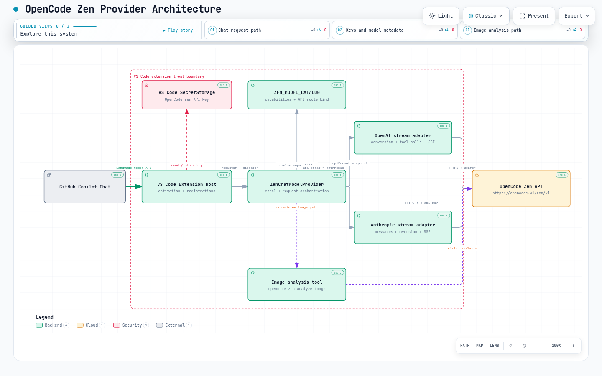

# OpenCode Zen Provider

VS Code extension project for using curated OpenCode Zen models in Copilot Chat with your own OpenCode Zen API key.

## Requirements

- VS Code 1.104.0 or later
- GitHub Copilot extension installed and active
- An OpenCode Zen API key from <https://opencode.ai/auth>

## Installation

### From Source

1. Clone this repository.
2. Run `bun install --ignore-scripts && bun run compile`.
3. Press `F5` in VS Code to launch the Extension Development Host.

### From VSIX

1. Run `bun install --ignore-scripts && bun run package:vsix`.
2. Install the generated `.vsix` file via **Install from VSIX...** in the Extensions view.

## Setup

1. Open Copilot Chat and open the model picker.
2. Add or configure **OpenCode Zen**.
3. Enter your OpenCode Zen API key when prompted.
4. If needed, run `OpenCode Zen: Manage OpenCode Zen API Key` from the Command Palette.
5. Select **OpenCode Zen** in Copilot Chat and choose a model.

## Supported Models

The extension bundles a static `ZEN_MODEL_CATALOG` (in `src/model-catalog.ts`) that mirrors the current OpenCode Zen API model lineup, including:

- Claude: Haiku 4.5, Sonnet 4/4.5/4.6/**5**, Opus 4.1/4.5/4.6/4.7/4.8/**5**, Fable 5
- DeepSeek: V4 Pro, V4 Flash, V4 Flash Free
- Gemini: 3 Flash, 3.1 Pro, 3.5 Flash, **3.5 Flash Lite**, **3.6 Flash**
- GPT: 5/5.1/5.2/5.3/5.4/5.5 series, **5.6 Luna / Sol / Terra**, Codex variants
- Grok: Build 0.1, **4.5**
- Kimi: K2.5, K2.6, **K2.7 Code**, **K3**
- GLM: 5, 5.1, 5.2
- MiniMax: M2.5, M2.7, **M3**
- Qwen: 3.5 Plus, 3.6 Plus
- Free models: Big Pickle, MiMo V2.5 Free, Nemotron 3 Ultra Free, North Mini Code Free, **Ling 3.0 Flash Free**, **Laguna S 2.1 Free**

For the full table of capabilities (context window, vision, tools, thinking, API format), see [docs/models.md](docs/models.md).

## Architecture

[](docs/architecture.html)

- [Open the interactive architecture diagram](docs/architecture.html) — Request path, key storage, model routing, and image-analysis fallback

## Documentation

- [Supported Models](docs/models.md) — Full model list, capabilities, context window, and model quirks

## Current V1 Scope

- Provider registration, API key management, static model catalog, and core chat-provider wiring are included.
- The custom image-analysis tool is available via `opencode_zen_analyze_image` and automatic image fallback for non-vision models.
- Non-vision models either switch to a vision-capable fallback model or delegate to the image-analysis tool when images are attached.

## Development

```bash
bun install --ignore-scripts
bun run compile
bun run lint
bun run test -- --runInBand
```

Press `F5` in VS Code to launch the Extension Development Host.

### Available Scripts

- `bun run compile` - TypeScript compile
- `bun run watch` - TypeScript watch mode
- `bun run test` - Run Jest
- `bun run lint` - Run ESLint
- `bun run lint:fix` - Auto-fix ESLint issues
- `bun run format` - Run Prettier
- `bun run package:vsix` - Build a VSIX package

## Marketplace Packaging

```bash
bun run package:vsix
```

## Privacy

- Your API key is stored securely in VS Code SecretStorage.
- The Zen provider base URL is `https://opencode.ai/zen/v1`.
